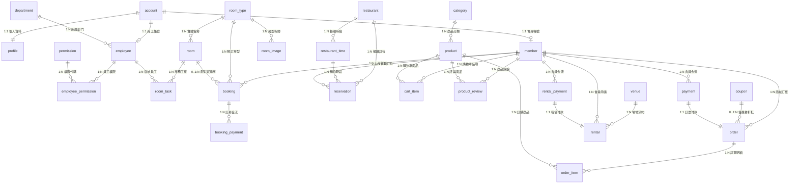

# 星澄飯店管理系統 (Starlight Hotel) - 資料庫規格與關聯架構說明

> 本文件依據 Spring Boot 3 JPA 實體模型與 Microsoft SQL Server 2022 (`finalproject`) 資料庫規格整理，完整涵蓋系統全部 27 張實體資料表結構與外鍵關聯。

---

## 一、 資料庫實體關聯圖 (ER Diagram)

---

## 二、 資料表詳細清單 (共 27 張)

### 1. 會員身分與員工權限模組 (Auth & RBAC)

#### `account` (系統帳號表)
| 欄位名稱 | 資料型態 | 允許空值 | 預設值 | 約束與說明 |
|---|---|---|---|---|
| `account_id` | INT | NO | IDENTITY(1,1) | PK, 帳號流水號 |
| `username` | VARCHAR(50) | NO | - | UNIQUE, 登入帳號 (Email 或使用者名稱) |
| `password` | VARCHAR(255) | NO | - | BCrypt 加密雜湊密碼 |
| `status` | VARCHAR(20) | NO | `'ACTIVE'` | 帳號狀態 (`ACTIVE`, `INACTIVE`) |

#### `profile` (個人資料與基本屬性)
| 欄位名稱 | 資料型態 | 允許空值 | 預設值 | 約束與說明 |
|---|---|---|---|---|
| `profile_id` | INT | NO | IDENTITY(1,1) | PK, 個人資料流水號 |
| `account_id` | INT | NO | - | UNIQUE, FK -> `account.account_id` |
| `name` | VARCHAR(50) | NO | - | 真實姓名 |
| `email` | VARCHAR(100) | YES | - | 聯絡信箱 |
| `phone` | VARCHAR(20) | YES | - | 聯絡電話 / 手機 |
| `zipcode` | VARCHAR(10) | YES | - | 郵遞區號 |
| `city` | VARCHAR(50) | YES | - | 居住縣市 |
| `district` | VARCHAR(50) | YES | - | 鄉鎮市區 |
| `address` | VARCHAR(200) | YES | - | 街道地址 |
| `birthday` | DATE | YES | - | 生日 (用於會員年齡分析) |
| `gender` | VARCHAR(10) | YES | - | 性別 |
| `avatar_url` | VARCHAR(255) | YES | - | 大頭貼儲存路徑 |
| `created_at` | DATETIME | NO | `GETDATE()` | 建立時間 |
| `updated_at` | DATETIME | NO | `GETDATE()` | 最後更新時間 |

#### `member` (會員實體)
| 欄位名稱 | 資料型態 | 允許空值 | 預設值 | 約束與說明 |
|---|---|---|---|---|
| `member_id` | INT | NO | IDENTITY(1,1) | PK, 會員編號 |
| `account_id` | INT | NO | - | UNIQUE, FK -> `account.account_id` |

#### `department` (部門組織)
| 欄位名稱 | 資料型態 | 允許空值 | 預設值 | 約束與說明 |
|---|---|---|---|---|
| `department_id` | INT | NO | IDENTITY(1,1) | PK, 部門編號 |
| `department_name` | VARCHAR(50) | NO | - | 部門名稱 (如：客務部、餐飲部、房務部) |

#### `employee` (員工資訊)
| 欄位名稱 | 資料型態 | 允許空值 | 預設值 | 約束與說明 |
|---|---|---|---|---|
| `employee_id` | INT | NO | IDENTITY(1,1) | PK, 員工流水號 |
| `department_id` | INT | NO | - | FK -> `department.department_id` |
| `account_id` | INT | NO | - | UNIQUE, FK -> `account.account_id` |
| `position` | VARCHAR(50) | NO | - | 職位名稱 (如：經理、櫃檯專員、房務員) |

#### `permission` (功能權限項目)
| 欄位名稱 | 資料型態 | 允許空值 | 預設值 | 約束與說明 |
|---|---|---|---|---|
| `permission_id` | INT | NO | IDENTITY(1,1) | PK, 權限流水號 |
| `permission_code` | VARCHAR(50) | NO | - | 權限代碼 (如：`ROOM_MANAGE`, `ORDER_MANAGE`) |
| `permission_name` | VARCHAR(50) | NO | - | 權限顯示名稱 |

#### `employee_permission` (員工與權限對應關聯表)
| 欄位名稱 | 資料型態 | 允許空值 | 預設值 | 約束與說明 |
|---|---|---|---|---|
| `employee_id` | INT | NO | - | PK, FK -> `employee.employee_id` |
| `permission_id` | INT | NO | - | PK, FK -> `permission.permission_id` |

---

### 2. 客房預訂與房務管理模組 (Room Booking & Housekeeping)

#### `room_type` (房型規格表)
| 欄位名稱 | 資料型態 | 允許空值 | 預設值 | 約束與說明 |
|---|---|---|---|---|
| `room_type_id` | INT | NO | IDENTITY(1,1) | PK, 房型編號 |
| `type_name` | VARCHAR(50) | NO | - | 房型名稱 (如：標準雙人房、豪華海景套房) |
| `bed_type` | VARCHAR(50) | NO | - | 床型規格 (如：一大床、兩小床) |
| `capacity` | INT | NO | - | 容納人數上限 |
| `room_description` | VARCHAR(100) | YES | - | 房型特色簡介 |
| `price_per_night` | INT | NO | - | 每晚定價 (TWD) |
| `available_rooms` | INT | NO | - | 總房間數量 |

#### `room_image` (房型相片集)
| 欄位名稱 | 資料型態 | 允許空值 | 預設值 | 約束與說明 |
|---|---|---|---|---|
| `image_id` | INT | NO | IDENTITY(1,1) | PK, 圖片編號 |
| `path` | VARCHAR(255) | NO | - | 圖片靜態儲存路徑 |
| `image_description` | VARCHAR(255) | YES | - | 圖片說明文字 |
| `room_type_id` | INT | NO | - | FK -> `room_type.room_type_id` |

#### `room` (實體客房表)
| 欄位名稱 | 資料型態 | 允許空值 | 預設值 | 約束與說明 |
|---|---|---|---|---|
| `room_id` | INT | NO | IDENTITY(1,1) | PK, 房間流水號 |
| `room_number` | VARCHAR(20) | NO | - | UNIQUE, 房號 (如：`101`, `302`) |
| `room_type_id` | INT | NO | - | FK -> `room_type.room_type_id` |
| `floor` | INT | NO | - | 所在樓層 |
| `room_status` | VARCHAR(20) | NO | - | 狀態 (`AVAILABLE`, `OCCUPIED`, `CLEANING`, `MAINTENANCE`) |

#### `room_task` (房務清潔與維修工單)
| 欄位名稱 | 資料型態 | 允許空值 | 預設值 | 約束與說明 |
|---|---|---|---|---|
| `task_id` | INT | NO | IDENTITY(1,1) | PK, 工單編號 |
| `room_id` | INT | NO | - | FK -> `room.room_id` |
| `employee_id` | INT | NO | - | FK -> `employee.employee_id` |
| `priority` | VARCHAR(20) | NO | - | 優先等級 (`LOW`, `MEDIUM`, `HIGH`, `URGENT`) |
| `task_type` | VARCHAR(20) | NO | - | 任務類別 (`CLEANING`, `MAINTENANCE`, `INSPECTION`) |
| `task_status` | VARCHAR(20) | NO | - | 工單進度 (`PENDING`, `IN_PROGRESS`, `COMPLETED`, `CANCELLED`) |
| `remark` | VARCHAR(100) | YES | - | 備註需求 |
| `created_at` | DATETIME | NO | - | 指派時間 |
| `completed_at` | DATETIME | YES | - | 完成時間 |

#### `booking` (客房預約訂單)
| 欄位名稱 | 資料型態 | 允許空值 | 預設值 | 約束與說明 |
|---|---|---|---|---|
| `booking_id` | INT | NO | IDENTITY(1,1) | PK, 訂房編號 |
| `booking_price` | INT | NO | - | 訂單總計金額 |
| `check_in_date` | DATETIME | NO | - | 預定入住日期 |
| `check_out_date` | DATETIME | NO | - | 預定退房日期 |
| `guest_num` | INT | NO | - | 入住人數 |
| `booking_status` | VARCHAR(20) | NO | - | 狀態 (`BOOKED`, `PAID`, `CHECKED_IN`, `COMPLETED`, `CANCELLED`) |
| `room_id` | INT | YES | - | FK -> `room.room_id` (排房指派) |
| `room_type_id` | INT | NO | - | FK -> `room_type.room_type_id` |
| `member_id` | INT | NO | - | FK -> `member.member_id` |
| `created_at` | DATETIME | NO | - | 下單時間 |

#### `booking_payment` (訂房金流紀錄)
| 欄位名稱 | 資料型態 | 允許空值 | 預設值 | 約束與說明 |
|---|---|---|---|---|
| `payment_id` | INT | NO | IDENTITY(1,1) | PK, 金流流水號 |
| `booking_id` | INT | NO | - | FK -> `booking.booking_id` |
| `amount` | INT | NO | - | 交易金額 |
| `payment_method` | VARCHAR(50) | YES | - | 付款方式 (`ECPAY`, `CREDIT_CARD`) |
| `payment_status` | VARCHAR(20) | NO | - | 金流狀態 (`PENDING`, `PAID`, `REFUNDED`, `FAILED`) |
| `transaction_id` | VARCHAR(50) | YES | - | 綠界交易流水號 / 授權碼 |
| `created_at` | DATETIME2 | NO | - | 交易建立時間 |
| `paid_at` | DATETIME2 | YES | - | 付款完成時間 |

---

### 3. 餐廳與線上訂位模組 (Restaurant & Dining)

#### `restaurant` (餐廳基本資料)
| 欄位名稱 | 資料型態 | 允許空值 | 預設值 | 約束與說明 |
|---|---|---|---|---|
| `restaurant_id` | INT | NO | IDENTITY(1,1) | PK, 餐廳流水號 |
| `restaurant_name` | VARCHAR(50) | NO | - | 餐廳名稱 (如：星澄美饌百匯、頂級牛排館) |
| `address` | VARCHAR(100) | NO | - | 所在館別與樓層 |
| `phone` | VARCHAR(20) | NO | - | 預約洽詢專線 |
| `capacity` | INT | NO | - | 總容納人數上限 |
| `description` | VARCHAR(255) | YES | - | 餐廳簡介特色 |

#### `restaurant_time` (餐期時段設定)
| 欄位名稱 | 資料型態 | 允許空值 | 預設值 | 約束與說明 |
|---|---|---|---|---|
| `time_id` | INT | NO | IDENTITY(1,1) | PK, 時段流水號 |
| `restaurant_id` | INT | NO | - | FK -> `restaurant.restaurant_id` |
| `meal_type` | VARCHAR(20) | NO | - | 餐期 (`BREAKFAST`, `LUNCH`, `AFTERNOON_TEA`, `DINNER`) |
| `open_time` | TIME(0) | NO | - | 時段開始時間 |
| `close_time` | TIME(0) | NO | - | 時段結束時間 |

#### `reservation` (線上訂位單)
| 欄位名稱 | 資料型態 | 允許空值 | 預設值 | 約束與說明 |
|---|---|---|---|---|
| `reservation_id` | INT | NO | IDENTITY(1,1) | PK, 訂位編號 |
| `member_id` | INT | YES | - | FK -> `member.member_id` (會員登入訂位) |
| `contact_name` | VARCHAR(50) | YES | - | 聯絡人姓名 (非會員訂位必填) |
| `contact_phone` | VARCHAR(20) | YES | - | 聯絡人電話 (非會員訂位必填) |
| `restaurant_id` | INT | NO | - | FK -> `restaurant.restaurant_id` |
| `reservation_date` | DATE | NO | - | 用餐日期 |
| `time_id` | INT | NO | - | FK -> `restaurant_time.time_id` |
| `people_count` | INT | NO | - | 用餐人數 |
| `status` | VARCHAR(20) | NO | `N'已訂位'` | 狀態 (`已訂位`, `已入座`, `已完成`, `已取消`) |
| `create_time` | DATETIME | NO | `GETDATE()` | 建立時間 |

---

### 4. 周邊商城與訂單模組 (E-Commerce Mall & Orders)

#### `category` (商品分類表)
| 欄位名稱 | 資料型態 | 允許空值 | 預設值 | 約束與說明 |
|---|---|---|---|---|
| `category_id` | INT | NO | IDENTITY(1,1) | PK, 分類流水號 |
| `category_name` | VARCHAR(50) | YES | - | 分類名稱 (如：生活選品、飯店香氛、特色伴手禮) |

#### `product` (周邊商品表)
| 欄位名稱 | 資料型態 | 允許空值 | 預設值 | 約束與說明 |
|---|---|---|---|---|
| `product_id` | INT | NO | IDENTITY(1,1) | PK, 商品流水號 |
| `product_name` | VARCHAR(50) | NO | - | 商品名稱 |
| `category_id` | INT | NO | - | FK -> `category.category_id` |
| `description` | VARCHAR(255) | YES | - | 詳細描述 |
| `price` | INT | NO | - | 售價 (TWD) |
| `stock` | INT | NO | - | 當前庫存數量 |
| `ImageURL` | VARCHAR(255) | YES | - | 主圖片檔案路徑 |
| `status` | VARCHAR(50) | YES | - | 上下架狀態 (`AVAILABLE`, `OUT_OF_STOCK`, `DISCONTINUED`) |

#### `cart_item` (會員購物車品項)
| 欄位名稱 | 資料型態 | 允許空值 | 預設值 | 約束與說明 |
|---|---|---|---|---|
| `member_id` | INT | NO | - | PK, FK -> `member.member_id` |
| `product_id` | INT | NO | - | PK, FK -> `product.product_id` |
| `quantity` | INT | NO | 1 | 購買數量 (CHECK > 0) |
| `created_at` | DATETIME2 | NO | `SYSDATETIME()` | 加入時間 |
| `updated_at` | DATETIME2 | NO | `SYSDATETIME()` | 最後修改時間 |

#### `product_review` (商品星級評價與留言)
| 欄位名稱 | 資料型態 | 允許空值 | 預設值 | 約束與說明 |
|---|---|---|---|---|
| `review_id` | INT | NO | IDENTITY(1,1) | PK, 評價流水號 |
| `product_id` | INT | NO | - | FK -> `product.product_id` |
| `member_id` | INT | NO | - | FK -> `member.member_id` |
| `rating` | INT | NO | - | 星級評分 (CHECK: 1~5) |
| `comment` | NVARCHAR(1000) | NO | - | 評價心得內容 |
| `created_at` | DATETIME2 | NO | - | 發表時間 |
| `updated_at` | DATETIME2 | NO | - | 修改時間 |

#### `coupon` (行銷折扣券)
| 欄位名稱 | 資料型態 | 允許空值 | 預設值 | 約束與說明 |
|---|---|---|---|---|
| `coupon_id` | INT | NO | IDENTITY(1,1) | PK, 優惠券流水號 |
| `coupon_code` | VARCHAR(50) | NO | - | UNIQUE, 折扣碼 (如：`WELCOME100`) |
| `coupon_name` | VARCHAR(100) | NO | - | 活動名稱 |
| `discount_type` | VARCHAR(20) | NO | - | 類型 (`PERCENT` 百分比折抵, `FIXED` 固定金額) |
| `discount_value` | INT | NO | - | 折扣數值 |
| `minimum_amount` | INT | NO | 0 | 最低消費金額限制 |
| `start_date` | DATETIME | NO | - | 有效起始時間 |
| `end_date` | DATETIME | NO | - | 有效截止時間 |
| `status` | VARCHAR(20) | NO | `'ACTIVE'` | 狀態 (`ACTIVE`, `INACTIVE`) |

#### `payment` (商城購物付款紀錄)
| 欄位名稱 | 資料型態 | 允許空值 | 預設值 | 約束與說明 |
|---|---|---|---|---|
| `payment_id` | INT | NO | IDENTITY(1,1) | PK, 付款流水號 |
| `member_id` | INT | YES | - | FK -> `member.member_id` |
| `payment_method` | VARCHAR(50) | YES | - | 付款方式 (`ECPAY`, `CREDIT_CARD`) |
| `transaction_id` | VARCHAR(100) | YES | - | 綠界金流交易序號 |
| `total_price` | INT | NO | - | 實付金額 (CHECK >= 0) |
| `payment_status` | VARCHAR(20) | NO | `'PENDING'` | 狀態 (`PENDING`, `PAID`, `FAILED`, `REFUNDED`) |
| `payment_time` | DATETIME | YES | - | 完成付款時間 |
| `created_at` | DATETIME | NO | `GETDATE()` | 建立時間 |

#### `order` (商城訂單)
| 欄位名稱 | 資料型態 | 允許空值 | 預設值 | 約束與說明 |
|---|---|---|---|---|
| `order_id` | INT | NO | IDENTITY(1,1) | PK, 訂單編號 |
| `member_id` | INT | NO | - | FK -> `member.member_id` |
| `order_date` | DATETIME | NO | `GETDATE()` | 下單時間 |
| `original_amount` | INT | NO | 0 | 原價總金額 |
| `discount_amount` | INT | NO | 0 | 優惠券折抵金額 |
| `final_amount` | INT | NO | 0 | 應付結算金額 |
| `coupon_id` | INT | YES | - | FK -> `coupon.coupon_id` |
| `payment_id` | INT | YES | - | FK -> `payment.payment_id` |
| `order_status` | VARCHAR(20) | NO | `'PENDING'` | 訂單狀態 (`PENDING`, `COMPLETED`, `CANCELLED`) |

#### `order_item` (商城訂單明細)
| 欄位名稱 | 資料型態 | 允許空值 | 預設值 | 約束與說明 |
|---|---|---|---|---|
| `order_id` | INT | NO | - | PK, FK -> `order.order_id` |
| `product_id` | INT | NO | - | PK, FK -> `product.product_id` |
| `quantity` | INT | NO | - | 購買數量 (CHECK > 0) |
| `unit_price` | INT | NO | - | 購買當下单價 |
| `subtotal` | INT | NO | - | 小計金額 |

---

### 5. 多功能場地租借模組 (Venue & Rental Management)

#### `venue` (場地資訊表)
| 欄位名稱 | 資料型態 | 允許空值 | 預設值 | 約束與說明 |
|---|---|---|---|---|
| `venue_id` | INT | NO | - | PK, 場地編號 |
| `venue_name` | VARCHAR(50) | NO | - | 場地名稱 (如：星澄大宴會廳、多功能國際會議廳) |
| `capacity` | INT | NO | - | 最大容納人數 |
| `price_per_day` | INT | NO | - | 每日租借費用 (TWD) |
| `venue_status` | VARCHAR(50) | NO | - | 場地狀態 (`AVAILABLE`, `MAINTENANCE`, `BOOKED`) |

#### `rental_payment` (場地租借款項表)
| 欄位名稱 | 資料型態 | 允許空值 | 預設值 | 約束與說明 |
|---|---|---|---|---|
| `payment_id` | INT | NO | IDENTITY(1,1) | PK, 款項流水號 |
| `member_id` | INT | YES | - | FK -> `member.member_id` |
| `payment_method` | VARCHAR(50) | YES | - | 付款方式 (`ECPAY`, `TRANSFER`) |
| `payment_time` | DATETIME2 | YES | - | 付款時間 |
| `total_price` | INT | NO | - | 租金總額 |
| `payment_status` | VARCHAR(20) | NO | - | 款項狀態 (`PENDING`, `PAID`, `REFUNDED`) |

#### `rental` (場地預約租借申請表)
| 欄位名稱 | 資料型態 | 允許空值 | 預設值 | 約束與說明 |
|---|---|---|---|---|
| `rental_id` | INT | NO | IDENTITY(1,1) | PK, 租借申請編號 |
| `venue_id` | INT | NO | - | FK -> `venue.venue_id` |
| `member_id` | INT | NO | - | FK -> `member.member_id` |
| `event_name` | VARCHAR(50) | NO | - | 活動主題 / 用途 |
| `rental_date` | DATETIME | NO | - | 預定租借日期 |
| `guest_count` | INT | NO | - | 預估出席人數 |
| `payment_id` | INT | NO | - | FK -> `rental_payment.payment_id` |
| `rental_status` | VARCHAR(50) | NO | - | 申請狀態 (`PENDING`, `APPROVED`, `REJECTED`, `CANCELLED`) |
