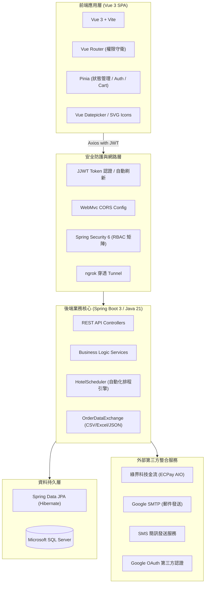
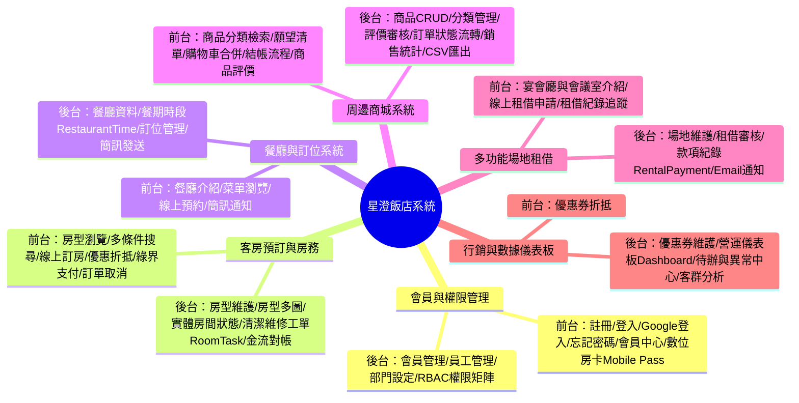
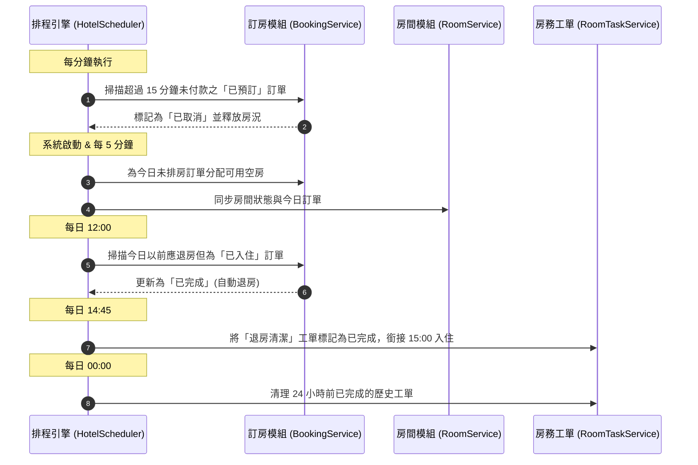

# 星澄飯店管理與線上服務系統 (Starlight Hotel)
## 專案功能整理與系統架構分析報告

---

### 目錄
1. [專案總覽與系統架構](#一-專案總覽與系統架構)
2. [系統核心模組功能清單](#二-系統核心模組功能清單)
   - [模組 1：會員身分與員工權限管理 (Auth & RBAC)](#模組-1會員身分與員工權限管理-auth--rbac)
   - [模組 2：客房預訂、房態與房務管理 (Room Booking & Housekeeping)](#模組-2客房預訂房態與房務管理-room-booking--housekeeping)
   - [模組 3：餐廳與線上訂位 (Restaurant & Dining)](#模組-3餐廳與線上訂位-restaurant--dining)
   - [模組 4：周邊電商商城 (E-Commerce Mall & Orders)](#模組-4周邊電商商城-e-commerce-mall--orders)
   - [模組 5：多功能場地租借 (Venue & Rental Management)](#模組-5多功能場地租借-venue--rental-management)
   - [模組 6：行銷優惠券與營運數據儀表板 (Marketing & Dashboard)](#模組-6行銷優惠券與營運數據儀表板-marketing--dashboard)
3. [排程自動化機制 (HotelScheduler)](#三-排程自動化機制-hotelscheduler)
4. [前後台路由與頁面功能對應總覽表](#四-前後台路由與頁面功能對應總覽表)
5. [技術特點與實作說明](#五-技術特點與實作說明)

---

### 一、 專案總覽與系統架構

**星澄飯店管理與線上服務系統 (Starlight Hotel)** 為前後端分離架構的飯店營運與線上預約管理平台。

系統劃分為兩大端點：
1. **前台旅客端 (Guest Facing Portal)**：提供客房預訂、餐廳訂位、商城購物、場地租借、數位通行證 (Mobile Pass) 與會員中心。
2. **後台營運端 (Back-Office Management Portal)**：提供櫃檯、房務、餐飲、商城與營運管理人員後台介面，包含即時房態、房務工單自動排程、庫存管理、訂單審核、RBAC 權限控管與營運數據儀表板。

#### 技術棧明細表

| 層級 | 核心技術 / 框架 | 版本 / 套件 | 說明 |
|---|---|---|---|
| **後端核心 (Backend)** | **Java 21** / **Spring Boot 3** | Spring Boot 3.x | RESTful API 服務 |
| **資料持久層 (Database)** | **Spring Data JPA** | Hibernate, MSSQL Driver | ORM 映射、交易管理與資料存取 |
| **資料庫 (Database Engine)** | **Microsoft SQL Server** | MSSQL 2022 | 關聯式資料庫 |
| **身分驗證與安全 (Security)** | **Spring Security** / **JJWT** | JJWT 0.11.5 | Token 無狀態驗證、RBAC 權限攔截 |
| **前端框架 (Frontend)** | **Vue 3 (Composition API)** | Vue 3.x / Vite | 響應式單頁應用 (SPA) |
| **狀態與路由 (Frontend State)**| **Pinia** / **Vue Router 4** | Pinia 2.x, Vue Router 4.x | 認證與購物車狀態管理、路由守衛 |
| **第三方整合 (Third-Party)** | **綠界金流 (ECPay)** / **Google SMTP** / **SMS** | ECPay AIO, Spring Mail | 信用卡線上金流、系統通知信、訂位簡訊 |
| **容器化與維運 (DevOps)** | **Docker** / **Docker Compose** / **ngrok** | Docker Engine 24+ | 容器編排部署、外網金流 Webhook 穿透 |

---

### 二、 系統核心模組功能清單

---

#### 模組 1：會員身分與員工權限管理 (Auth & RBAC)

##### 1.1 前台旅客端
- **會員註冊**：帳號唯一性檢查、密碼強度驗證、表單防重複提交。
- **身分驗證登入 / 登出**：
  - 本地帳密驗證，登入後發放 JWT Access Token。
  - 支援 **Google OAuth 第三方快捷登入**。
  - Token 自動續期機制（Axios 攔截器無感刷新）。
- **密碼管理與重設**：透過 Google SMTP 寄送密碼重設信與重設連結。
- **會員中心 (Member Profile)**：
  - 個人資料維護（姓名、性別、電話、生日、地址）。
  - 大頭貼上傳與即時預覽 (`AvatarStorageService`)。
  - 密碼修改。
  - 訂單彙整（訂房、餐廳訂位、商城訂單、場地租借、願望清單）。
- **行動通行證 (Mobile Pass)**：提供旅客專屬報到畫面、QR Code 與身分識別碼 (`MobilePassView`)。

##### 1.2 後台員工端
- **會員資料管理 (`MemberManageView`)**：
  - 會員清單檢視、模糊搜尋、狀態啟用/停用。
  - 會員年齡層與性別分佈統計 (`MemberDemographicsDTO`)。
- **員工與組織管理 (`EmployeeManageView`)**：
  - 員工資料維護、所屬部門 (`Department`) 與職位 (Position) 設定。
- **RBAC 細部權限控管 (`EmployeePermission`)**：
  - 依模組配置 9 項權限開關：`MEMBER_MANAGE`、`EMPLOYEE_MANAGE`、`RESTAURANT_MANAGE`、`PRODUCT_MANAGE`、`ORDER_MANAGE`、`COUPON_MANAGE`、`ROOM_MANAGE`、`BOOKING_MANAGE`、`VENUE_MANAGE`。
  - 前端路由守衛 (`router/index.js`) 與後端 `@PreAuthorize` 雙層檢查。

---

#### 模組 2：客房預訂、房態與房務管理 (Room Booking & Housekeeping)

##### 2.1 前台旅客端
- **房型展示與搜尋 (`RoomBookingView`)**：
  - 房型規格（容納人數、床型、坪數、備品設施、多圖相簿）。
  - 入住/退房日期區間選擇、入住人數條件篩選。
- **線上選房 (`RoomSelectionView`)**：即時庫存計算與可用房型配對。
- **訂房結帳與支付 (`RoomCheckoutView`)**：
  - 房客聯絡資訊填寫與備註。
  - 優惠券折扣碼折抵。
  - 整合**綠界金流 (ECPay)** 信用卡線上刷卡。
- **訂房記錄與退訂 (`MemberRoomBookingView`)**：查詢歷史與近期訂房、線上取消訂單。

##### 2.2 後台營運端
- **房型維護 (`AdminRoomTypeView`)**：房型 CRUD、定價與規格設定。
- **房型相簿管理 (`AdminRoomImageView`)**：多圖上傳、排序與主圖設定。
- **實體房間與房況控制 (`AdminRoomView`)**：
  - 房號與樓層配置。
  - 房間狀態切換（空房、已入住、清潔中、維修中、保留中）。
- **房務清潔與維修工單 (`AdminRoomTaskView`)**：
  - 清潔、備品補充、設施報修工單 (RoomTask) 建立與指派。
  - 工單狀態追蹤（待處理、處理中、已完成、已取消）。
- **訂房訂單管理 (`AdminRoomBookingView`)**：全館訂單搜尋、審核、Check-In / Check-Out 狀態更新。
- **訂房金流核帳 (`AdminRoomBookingPaymentView`)**：綠界交易流水號、金流狀態 (PENDING/PAID/REFUNDED) 對帳。

---

#### 模組 3：餐廳與線上訂位 (Restaurant & Dining)

##### 3.1 前台旅客端
- **餐廳介紹與菜單展示 (`RestaurantMenuView`)**：主題餐廳介紹、營業時間、菜單與價位。
- **線上訂位 (`RestaurantReservationView`)**：
  - 選擇餐廳、日期與餐期時段（早餐、午餐、下午茶、晚餐）。
  - 用餐人數與備註填寫。
  - 預約完成發送簡訊通知。

##### 3.2 後台營運端
- **餐廳資料管理 (`RestaurantManageView`)**：餐廳資訊 CRUD、桌數與容納上限。
- **餐期時段維護 (`RestaurantTimeManageView`)**：各餐廳開放時段與席位上限設定。
- **訂位名單管理 (`ReservationManageView`)**：
  - 預約清單查詢、狀態更新（已確認、已入座、已完成、已取消）。
  - 發送確認簡訊 (`SmsController` / `SmsService`)。

---

#### 模組 4：周邊電商商城 (E-Commerce Mall & Orders)

##### 4.1 前台旅客端
- **商品陳列與檢索 (`ProductShopView`)**：分類篩選、關鍵字搜尋、價格篩選與排序。
- **商品詳情與評價 (`ProductDetailView`)**：
  - 規格、庫存、多圖展示。
  - 星級評分 (1~5 星) 與圖文評論 (`ProductReview`)。
  - 願望清單收藏 (`ProductWishlistView`)。
- **購物車機制 (`CartView`)**：
  - 本地購物車與登入帳號購物車自動合併 (`MergeCartRequest`)。
  - 數量增減、即時小計與庫存上限防呆。
- **結帳與付款 (`CheckoutView` / `PaymentView`)**：
  - 收件資訊填寫、發票選項、優惠券折抵。
  - 綠界金流付款。
- **商城訂單查詢 (`MyOrdersView`)**：訂單進度追蹤（待付款、已付款、出貨中、已完成、已取消）與購買紀錄。

##### 4.2 後台營運端
- **商品與分類管理 (`ProductManageView` / `ProductAddView` / `ProductEditView`)**：
  - 商品 CRUD、分類 CRUD (`Category`)。
  - 圖片上傳與本地儲存 (`FileStorageService`)。
  - 庫存管理與上下架控制。
- **評價審核管理 (`ProductReviewController`)**：審核顧客評論留言。
- **商城訂單管理 (`AdminOrdersView`)**：
  - 訂單出貨、取消與退款處理。
  - 資料交換 (`OrderDataExchangeController`)：JSON / CSV 匯出、月度銷售統計。

---

#### 模組 5：多功能場地租借 (Venue & Rental Management)

##### 5.1 前台旅客端
- **場地空間導覽 (`VenueView`)**：宴會廳、會議室等空間規格、容納人數、設備與費率說明。
- **線上租借申請 (`RentalView`)**：選擇場地、日期、時段區間、活動用途與聯絡資訊。
- **租借進度查詢**：會員中心追蹤審核進度與繳款狀態。

##### 5.2 後台營運端
- **場地資料維護**：場地 CRUD、設備清單與圖片管理 (`VenueLocalImageController`)。
- **租借申請審核 (`AdminRentalView`)**：預約申請核准、駁回與時段調整。
- **租借款項追蹤 (`RentalPayment`)**：訂金與尾款紀錄、繳費狀態核對。
- **郵件通知 (`RentalMailService`)**：申請受理、審核通過與繳費通知信發送。

---

#### 模組 6：行銷優惠券與營運數據儀表板 (Marketing & Dashboard)

##### 6.1 優惠券系統 (Coupon System)
- **折扣規則配置 (`AdminCouponsView`)**：
  - 折扣模式：百分比折抵 (PERCENT) 與固定金額折抵 (FIXED)。
  - 設定最低消費門檻 (Minimum Amount)、有效起訖時間與啟用狀態。
- **全站折抵支援**：訂房結帳與商城購物車折抵 (`CouponService`)。

##### 6.2 營運數據儀表板 (Operations & Analytics Dashboard)
後台首頁 (`DashboardView`) 包含以下數據區塊：
- **即時指標卡片**：商品數、餐廳數、今日訂位數、會員人數。
- **今日待辦與異常中心 (Operations Center)**：
  - 今日入住 / 退房房間動態。
  - 待處理與進行中房務清潔維修工單。
  - 商城低庫存預警商品列表。
- **商城營收分析 (Order Analytics)**：訂單狀態分佈、月營收趨勢圖、熱銷商品排行。
- **訂房營收與即時房態 (Room Booking Analytics)**：房態分佈圓餅圖、月度訂房營收、熱門房型排行。
- **客群輪廓分析 (Member Demographics Analytics)**：會員居住縣市分佈、年齡層分佈、性別比例。

---

### 三、 排程自動化機制 (HotelScheduler)

後端透過 Spring `@Scheduled` 排程器 (`HotelScheduler.java`) 執行定時維護任務：

---

### 四、 前後台路由與頁面功能對應總覽表

| 模組分類 | 頁面名稱 | 前端路徑 (URL) | 前端 Vue 元件 | 後端主要 API Controller |
|---|---|---|---|---|
| **首頁與公開** | 飯店首頁 | `/` | `HomeView.vue` | - |
| | 關於星澄 | `/about` | `AboutView.vue` | - |
| | 數位房卡憑證 | `/mobile-pass` | `MobilePassView.vue` | `BookingController` |
| **會員前台** | 會員登入 / 登出 | `/login`, `/logout` | `LoginView.vue`, `LogoutView.vue` | `AuthController` |
| | 會員註冊 | `/register` | `RegisterView.vue` | `AuthController` |
| | 忘記密碼 | `/forgot-password` | `ForgotPasswordView.vue` | `AuthController` |
| | 會員中心 (個人資料) | `/member/profile` | `MemberProfileView.vue` | `MemberController` |
| | 修改密碼 | `/member/password` | `MemberPasswordView.vue` | `MemberController` |
| | 我的商品訂單 | `/member/orders` | `MyOrdersView.vue` | `OrderApiController` |
| | 我的商品收藏 | `/member/wishlist` | `ProductWishlistView.vue` | `ProductRestController` |
| | 我的訂房記錄 | `/member/room-bookings` | `MemberRoomBookingView.vue` | `BookingController` |
| **客房前台** | 房型瀏覽與預訂 | `/room-booking` | `RoomBookingView.vue` | `RoomTypeController` |
| | 房型選擇確認 | `/room-selection` | `RoomSelectionView.vue` | `RoomController` |
| | 訂房資料與結帳 | `/room-checkout` | `RoomCheckoutView.vue` | `RoomBookingEcpayController` |
| **餐飲前台** | 美饌菜單展示 | `/restaurant-menu` | `RestaurantMenuView.vue` | `RestaurantController` |
| | 餐廳線上訂位 | `/restaurant-reservation` | `RestaurantReservationView.vue` | `PublicReservationController` |
| **商城前台** | 周邊商品一覽 | `/products` | `ProductShopView.vue` | `ProductRestController` |
| | 商品詳細頁面 | `/products/:id` | `ProductDetailView.vue` | `ProductReviewController` |
| | 購物車 | `/cart` | `CartView.vue` | `CartController` |
| | 結帳頁面 | `/checkout` | `CheckoutView.vue` | `OrderApiController` |
| | 綠界/信用卡付款 | `/payment/:orderId` | `PaymentView.vue` | `PaymentController` |
| **場地前台** | 場地空間導覽 | `/venues` | `VenueView.vue` | `VenueController` |
| | 線上場地租借申請 | `/rentals` | `RentalView.vue` | `RentalController` |
| **後台營運** | 營運數據儀表板 | `/admin` | `DashboardView.vue` | 統計 API (Order, Booking, Member) |
| | 會員資料管理 | `/admin/members` | `MemberManageView.vue` | `MemberController` |
| | 員工與權限管理 | `/admin/employees` | `EmployeeManageView.vue` | `EmployeeController`, `PermissionController` |
| | 房型資料維護 | `/admin/room-types` | `AdminRoomTypeView.vue` | `RoomTypeController` |
| | 房型圖片管理 | `/admin/room-images` | `AdminRoomImageView.vue` | `RoomImageController` |
| | 實體房間狀態控制 | `/admin/room-status` | `AdminRoomView.vue` | `RoomController` |
| | 房務清潔維修工單 | `/admin/room-task` | `AdminRoomTaskView.vue` | `RoomTaskController` |
| | 訂房訂單管理 | `/admin/room-booking` | `AdminRoomBookingView.vue` | `BookingController` |
| | 訂房金流核銷 | `/admin/booking-payments` | `AdminRoomBookingPaymentView.vue` | `BookingPaymentController` |
| | 餐廳資料管理 | `/admin/restaurants` | `RestaurantManageView.vue` | `RestaurantController` |
| | 餐期時段設定 | `/admin/restaurant-times` | `RestaurantTimeManageView.vue` | `RestaurantTimeController` |
| | 餐廳訂位名單 | `/admin/reservations` | `ReservationManageView.vue` | `ReservationController` |
| | 商品管理 (含新增/編輯) | `/admin/products` | `ProductManageView.vue` | `ProductRestController` |
| | 商城訂單管理 | `/admin/orders` | `AdminOrdersView.vue` | `OrderApiController` |
| | 優惠券行銷管理 | `/admin/coupons` | `AdminCouponsView.vue` | `CouponController` |
| | 場地管理與租借審核 | `/admin/rental` | `AdminRentalView.vue` | `RentalController`, `RentalPaymentController` |

---

### 五、 技術特點與實作說明

1. **前後端分離架構**
   - 前端採用 Vue 3 Composition API 與 Pinia，透過 Vite 進行反向代理；後端採用 Spring Boot 3 與 Java 21，透過 Spring Data JPA 進行關聯資料庫存取。
2. **身分驗證與 RBAC 權限控管**
   - 採用 JJWT Token 無狀態驗證，並依員工部門與職務配置 9 項權限開關，由前端路由守衛與後端 `@PreAuthorize` 共同控管。
3. **金流與外部服務整合**
   - 訂房與電商商城整合**綠界科技 (ECPay)** 信用卡交易介接；通知系統結合 Google SMTP 郵件與 SMS 簡訊服務。
4. **營運排程引擎 (`HotelScheduler`)**
   - 透過 Spring `@Scheduled` 自動化處理未付款訂單逾時取消、每日中午退房狀態更新、房務工單狀態轉換與過期資料清理。
5. **視覺化數據儀表板**
   - 整合營收趨勢圖、房態佔比、熱銷排行、會員人口學分佈與今日待辦異常中心。
6. **容器化部署**
   - 提供 `docker-compose.yml` 與初始化 SQL 腳本 `init-db.sql`，支援 SQL Server、Spring Boot 與 ngrok 穿透環境部署。
