# 星澄飯店管理與線上服務系統 (Starlight Hotel) - 網站架構與路由導覽 (Sitemap)

> 本文件依據 `hotel-frontend/src/router/index.js` 整理，完整描繪系統前台旅客端、會員中心與後台營運端之頁面層級與路由結構。

---

## 一、 網站架構視覺導覽圖 (Visual Sitemaps)

### 1. 前台旅客端與會員中心 (Guest Facing Portal)

```mermaid
flowchart TD
    Root["星澄飯店官網 (MainLayout)"]

    %% 公開頁面
    Root --> Home["/ 首頁 (HomeView)"]
    Root --> About["/about 關於星澄 (AboutView)"]
    Root --> MobilePass["/mobile-pass 數位房卡憑證 (MobilePassView)"]

    %% 身分驗證
    Root --> Auth["身分驗證"]
    Auth --> Login["/login 登入 (LoginView)"]
    Auth --> Register["/register 註冊 (RegisterView)"]
    Auth --> Forgot["/forgot-password 忘記密碼 (ForgotPasswordView)"]
    Auth --> Logout["/logout 登出 (LogoutView)"]

    %% 客房預訂
    Root --> BookingFlow["客房預訂流程"]
    BookingFlow --> RoomBooking["/room-booking 房型瀏覽與篩選 (RoomBookingView)"]
    RoomBooking --> RoomSelection["/room-selection 房型選擇確認 (RoomSelectionView)"]
    RoomSelection --> RoomCheckout["/room-checkout 訂房資料與結帳 (RoomCheckoutView)"]

    %% 美饌餐飲
    Root --> Dining["餐飲預約"]
    Dining --> Menu["/restaurant-menu 美饌菜單展示 (RestaurantMenuView)"]
    Dining --> Reserve["/restaurant-reservation 線上訂位 (RestaurantReservationView)"]

    %% 周邊電商
    Root --> Mall["周邊電商"]
    Mall --> Shop["/products 商品一覽 (ProductShopView)"]
    Shop --> Detail["/products/:id 商品詳情與評價 (ProductDetailView)"]
    Mall --> Cart["/cart 購物車 (CartView)"]
    Cart --> Checkout["/checkout 商城結帳 (CheckoutView)"]
    Checkout --> Payment["/payment/:orderId 綠界/信用卡付款 (PaymentView)"]

    %% 場地租借
    Root --> VenueRental["場地空間與租借"]
    VenueRental --> VenueList["/venues 場地空間導覽 (VenueView)"]
    VenueRental --> RentalApply["/rentals 線上租借申請 (RentalView)"]

    %% 會員中心
    Root --> MemberCenter["/member 會員中心 (MemberLayout)"]
    MemberCenter --> Profile["/member/profile 個人資料維護 (MemberProfileView)"]
    MemberCenter --> Password["/member/password 修改密碼 (MemberPasswordView)"]
    MemberCenter --> MemberOrders["/member/orders 我的商城訂單 (MyOrdersView)"]
    MemberCenter --> Wishlist["/member/wishlist 我的商品收藏 (ProductWishlistView)"]
    MemberCenter --> RoomBookings["/member/room-bookings 我的訂房記錄 (MemberRoomBookingView)"]
    MemberCenter --> MemberRentals["/member/rentals 我的場地預約 (RentalView)"]
```

---

### 2. 後台營運管理端 (Back-Office Management Portal)

```mermaid
flowchart TD
    AdminRoot["後台營運系統 /admin (AdminLayout - 需員工權限)"]

    AdminRoot --> Dashboard["/admin 營運數據儀表板 (DashboardView)"]

    %% 會員與員工
    AdminRoot --> Org["會員與組織管理"]
    Org --> AdminMembers["/admin/members 會員資料管理 (MemberManageView)<br/>[MEMBER_MANAGE]"]
    Org --> AdminEmployees["/admin/employees 員工與權限管理 (EmployeeManageView)<br/>[EMPLOYEE_MANAGE]"]

    %% 客房與房務
    AdminRoot --> RoomOps["客房與房務營運 [ROOM_MANAGE / BOOKING_MANAGE]"]
    RoomOps --> RoomStatus["/admin/room-status 實體房間狀態控制 (AdminRoomView)"]
    RoomOps --> RoomTypes["/admin/room-types 房型資料維護 (AdminRoomTypeView)"]
    RoomOps --> RoomImages["/admin/room-images 房型圖片管理 (AdminRoomImageView)"]
    RoomOps --> RoomTasks["/admin/room-task 房務清潔維修工單 (AdminRoomTaskView)"]
    RoomOps --> RoomBookingsAdmin["/admin/room-booking 訂房訂單管理 (AdminRoomBookingView)"]
    RoomOps --> BookingPayments["/admin/booking-payments 訂房金流核銷 (AdminRoomBookingPaymentView)"]

    %% 餐飲管理
    AdminRoot --> DiningOps["餐飲營運 [RESTAURANT_MANAGE]"]
    DiningOps --> AdminRest["/admin/restaurants 餐廳資料管理 (RestaurantManageView)"]
    DiningOps --> AdminRestTimes["/admin/restaurant-times 餐期時段設定 (RestaurantTimeManageView)"]
    DiningOps --> AdminReservations["/admin/reservations 餐廳訂位名單 (ReservationManageView)"]

    %% 商城與行銷
    AdminRoot --> MallOps["周邊商城與行銷"]
    MallOps --> AdminProducts["/admin/products 商品與分類管理 (ProductManageView)<br/>[PRODUCT_MANAGE]"]
    AdminProducts --> ProductAdd["/admin/products/add 新增商品 (ProductAddView)"]
    AdminProducts --> ProductEdit["/admin/products/:id/edit 編輯商品 (ProductEditView)"]
    MallOps --> AdminOrders["/admin/orders 商城訂單管理 (AdminOrdersView)<br/>[ORDER_MANAGE]"]
    MallOps --> AdminCoupons["/admin/coupons 優惠券行銷管理 (AdminCouponsView)<br/>[COUPON_MANAGE]"]

    %% 場地租借
    AdminRoot --> VenueOps["場地租借營運 [VENUE_MANAGE]"]
    VenueOps --> AdminVenues["/admin/venues 場地清單與規格 (VenueView)"]
    VenueOps --> AdminRental["/admin/rental 場地租借申請審核 (AdminRentalView)"]
```

---

## 二、 前後台路由詳細清單

### 1. 前台旅客端 (Guest Routes)

| 模組分類 | 頁面名稱 | 路由路徑 (URL) | 版型 (Layout) | Vue 元件檔案 | 存取限制 |
|---|---|---|---|---|---|
| **首頁與簡介** | 飯店首頁 | `/` | `MainLayout` | `HomeView.vue` | 公開 |
| | 關於星澄 | `/about` | `MainLayout` | `AboutView.vue` | 公開 |
| | 數位房卡憑證 | `/mobile-pass` | 獨立全螢幕 | `MobilePassView.vue` | 公開 / 憑證代碼 |
| **身分驗證** | 會員登入 | `/login` | `MainLayout` | `LoginView.vue` | 公開 |
| | 會員登出 | `/logout` | `MainLayout` | `LogoutView.vue` | 公開 |
| | 會員註冊 | `/register` | `MainLayout` | `RegisterView.vue` | 公開 |
| | 忘記密碼 | `/forgot-password` | `MainLayout` | `ForgotPasswordView.vue` | 公開 |
| **客房預訂** | 房型瀏覽與篩選 | `/room-booking` | `MainLayout` | `RoomBookingView.vue` | 公開 |
| | 房型選擇確認 | `/room-selection` | `MainLayout` | `RoomSelectionView.vue` | 公開 |
| | 訂房結帳與支付 | `/room-checkout` | `MainLayout` | `RoomCheckoutView.vue` | 需登入會員 |
| **美饌餐飲** | 美饌菜單展示 | `/restaurant-menu` | `MainLayout` | `RestaurantMenuView.vue` | 公開 |
| | 餐廳線上訂位 | `/restaurant-reservation` | `MainLayout` | `RestaurantReservationView.vue` | 公開 |
| **周邊商城** | 商品瀏覽一覽 | `/products` | `MainLayout` | `ProductShopView.vue` | 公開 |
| | 商品詳情與評價 | `/products/:id` | `MainLayout` | `ProductDetailView.vue` | 公開 |
| | 購物車 | `/cart` | `MainLayout` | `CartView.vue` | 公開 |
| | 商城結帳 | `/checkout` | `MainLayout` | `CheckoutView.vue` | 需登入會員 |
| | 綠界/信用卡付款 | `/payment/:orderId` | `MainLayout` | `PaymentView.vue` | 需登入會員 |
| **場地租借** | 場地空間導覽 | `/venues` | `MainLayout` | `VenueView.vue` | 公開 |
| | 線上場地租借申請 | `/rentals` | `MainLayout` | `RentalView.vue` | 需登入會員 |
| **會員中心** | 個人資料首頁 | `/member`, `/member/profile` | `MemberLayout` | `MemberProfileView.vue` | 需登入會員 |
| | 修改密碼 | `/member/password` | `MemberLayout` | `MemberPasswordView.vue` | 需登入會員 |
| | 我的商品訂單 | `/member/orders` | `MemberLayout` | `MyOrdersView.vue` | 需登入會員 |
| | 我的商品收藏 | `/member/wishlist` | `MemberLayout` | `ProductWishlistView.vue` | 需登入會員 |
| | 我的訂房記錄 | `/member/room-bookings` | `MemberLayout` | `MemberRoomBookingView.vue` | 需登入會員 |
| | 我的場地預約 | `/member/rentals` | `MemberLayout` | `RentalView.vue` | 需登入會員 |

---

### 2. 後台營運端 (Back-Office Admin Routes)

> 所有後台路由均受 `AdminLayout` 包覆，並要求 `requiresAuth: true` 與 `requiresEmployee: true`。

| 模組分類 | 頁面名稱 | 路由路徑 (URL) | Vue 元件檔案 | 權限要求 (RBAC Permission) |
|---|---|---|---|---|
| **首頁** | 營運數據儀表板 | `/admin` | `DashboardView.vue` | 員工登入 |
| **會員管理** | 會員資料與客群統計 | `/admin/members` | `MemberManageView.vue` | `MEMBER_MANAGE` |
| **員工管理** | 員工與權限配置 | `/admin/employees` | `EmployeeManageView.vue` | `EMPLOYEE_MANAGE` |
| **客房管理** | 實體房間狀態控制 | `/admin/room-status` | `AdminRoomView.vue` | `ROOM_MANAGE` / `BOOKING_MANAGE` |
| | 房型資料維護 | `/admin/room-types` | `AdminRoomTypeView.vue` | `ROOM_MANAGE` / `BOOKING_MANAGE` |
| | 房型相簿管理 | `/admin/room-images` | `AdminRoomImageView.vue` | `ROOM_MANAGE` / `BOOKING_MANAGE` |
| | 房務清潔維修工單 | `/admin/room-task` | `AdminRoomTaskView.vue` | `ROOM_MANAGE` / `BOOKING_MANAGE` |
| | 訂房訂單管理 | `/admin/room-booking` | `AdminRoomBookingView.vue` | `ROOM_MANAGE` / `BOOKING_MANAGE` |
| | 訂房金流核銷 | `/admin/booking-payments` | `AdminRoomBookingPaymentView.vue` | `ROOM_MANAGE` / `BOOKING_MANAGE` |
| **餐飲管理** | 餐廳資料管理 | `/admin/restaurants` | `RestaurantManageView.vue` | `RESTAURANT_MANAGE` |
| | 餐期時段設定 | `/admin/restaurant-times` | `RestaurantTimeManageView.vue` | `RESTAURANT_MANAGE` |
| | 餐廳訂位名單 | `/admin/reservations` | `ReservationManageView.vue` | `RESTAURANT_MANAGE` |
| **商城管理** | 商品清單與上下架 | `/admin/products` | `ProductManageView.vue` | `PRODUCT_MANAGE` |
| | 新增商品 | `/admin/products/add` | `ProductAddView.vue` | `PRODUCT_MANAGE` |
| | 編輯商品 | `/admin/products/:id/edit` | `ProductEditView.vue` | `PRODUCT_MANAGE` |
| | 商城訂單管理 | `/admin/orders` | `AdminOrdersView.vue` | `ORDER_MANAGE` |
| **行銷管理** | 優惠券行銷管理 | `/admin/coupons` | `AdminCouponsView.vue` | `COUPON_MANAGE` |
| **場地管理** | 場地規格與設施 | `/admin/venues` | `VenueView.vue` | `VENUE_MANAGE` |
| | 場地租借審核 | `/admin/rental` | `AdminRentalView.vue` | `VENUE_MANAGE` |
